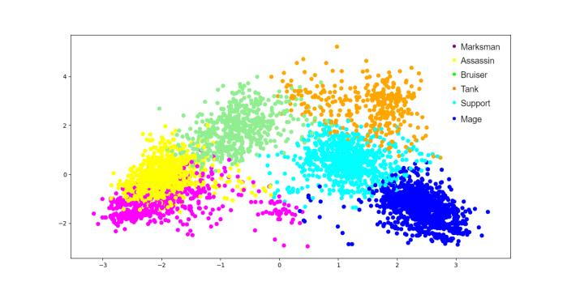
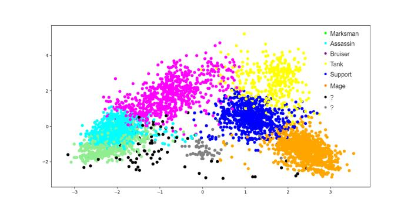
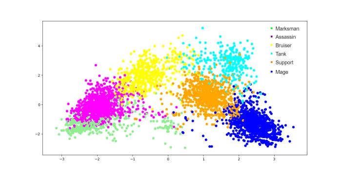

# Lol Category

### What does this project solve

Lol Category is an AI that solves classifying lol champions to 6 base classes:
- Assassin
- Mage
- Marksman
- Tank
- Bruiser
- Support

Classification is done using clustering algorithms:
- K-Means
- Spectral
- Expectation Maximization

### Idea behind the project

Idea for this project was to be able to classify league of legends champions
based on their builds and stats. At the time of doing this project (maybe even
now), there were only predefined classes for champions.
For example, `Fizz` is classified as an assassin, but there were times when he,
or it, was played as a bruiser. This would lead to wrong statistics for users.

### Gathering data

There was no existing data set, so data had to be fetched somehow.
Luckily, [LOL API](https://developer.riotgames.com/) had everything that was necessary to complete the project.
To avoid noise in data (random builds and trolls), only data for challenger and
master players was collected from EUW server, because `EU > NA`. :troll_face:

LOL API doesn't provide matches for a certain league/division, but provides
info about players in those leagues. The first step was to get all players in
those leagues. The second step was to get their last 20 matches. After playing
with the data, it was clear that short matches had a lot of troll builds, which
polluted the data, and gave bad results. Matches were filtered to contain only
matches above 30 minutes.

477 matches were gathered, which means 4770 examples of champion builds and
stats.

The script for gathering the data can be found
[here](https://github.com/vonum/get-lol-matches/)
Riot announced changing of LOL API, so it could get deprecated.

### Data used for classification

- Physical damage dealt (%)
- Magical damage dealt (%)
- Bonus health
- Bonus mana
- Bonus armor
- Bonus magic resistance
- Bonus attack speed (%)

Some stats were not used, because they depended too much on the players
performance. Idea was to be able to classify every champion regardless of the
players performance.

Some examples of such data:
- CS per minute
- Damage dealt per minute
- Gold per minute

### Preparing data

All data needed to be normalized because matches never lasted the same, so
people who played in shorter matches would always have worse stats.

[Z-Score](https://statistics.laerd.com/statistical-guides/standard-score-2.php) was used to normalize the data.

### Visualization

Data was reduced to 2 dimensions from 7 dimensions (each attribute is one
dimension) using PCA (Principal Component Analysis) and visualized in 2D.

### Results

#### K-Means:

- Assassins 1331
- Mage 1092
- Marksman 561
- Tank 355
- Bruiser 543
- Support 888

#### Spectral:

- Assassins 1128
- Mage 1097
- Marksman 540
- Tank 362
- Bruiser 701
- Support 805
- None 137

#### Expectation Maximization:

- Assassins 1458
- Mage 1095
- Marksman 484
- Tank 301
- Bruiser 524
- Support 984

#### Interpretation

You can see in the results how similar classes are close to each other and non
similar classes are distant. At the time of classifying this data. Some of the
ADCs were building items as assassins, lethality items, which shows how these
two classes are close to each other. Also, bruisers are between tanks and
assassins, as they build somewhere in between. Mages and assassins and marksman
are nowhere close, while supports are between mages and tanks. Which makes
sense, because they build half tank, half ap, half regen depending on the
champion.

### Validation

[Silhouette Score](https://en.wikipedia.org/wiki/Silhouette_(clustering)) was
used for validation of clustering algorithms.

### Potential Use

Making classifications more reliable.
Automatizing making statistics for players.

### Improvement

Recognizing multiple classes for champions.
Recognizing more detailed classes for champions, see
[here](http://na.leagueoflegends.com/en/news/game-updates/gameplay/dev-blog-classes-subclasses).

### Technology Stack
- Python
- SciKit Learn
